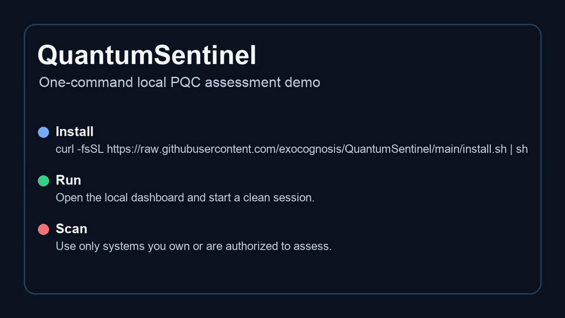

# QuantumSentinel

Open-source local scanner that discovers quantum-vulnerable crypto, builds an evidence-backed CBOM, and prioritizes post-quantum migration.

[](LICENSE)
[](package.json)
[](https://github.com/exocognosis/QuantumSentinel/actions/workflows/ci.yml)
[](https://github.com/exocognosis/QuantumSentinel/stargazers)

<video src="docs/demo/quantumsentinel-demo.mp4" controls muted playsinline width="960">
  Watch the short demo: docs/demo/quantumsentinel-demo.mp4
</video>

If the video does not render, view the GIF preview:



## Get Started In 30 Seconds

macOS or Linux:

```sh
curl -fsSL https://raw.githubusercontent.com/exocognosis/QuantumSentinel/main/install.sh | sh
```

Windows PowerShell:

```powershell
irm https://raw.githubusercontent.com/exocognosis/QuantumSentinel/main/install.ps1 | iex
```

Requirements:

- Git.
- Node.js 20.19 or newer.
- npm, which normally ships with Node.js.

The installer downloads QuantumSentinel into `./QuantumSentinel`, installs dependencies, builds the dashboard, starts the local API, and opens the local dashboard.

The dashboard starts at `http://127.0.0.1:5173`.
If that port is busy, the launcher selects the next available port.
Press `Ctrl+C` to stop the app.

## What It Does

QuantumSentinel runs a local post-quantum cryptography (PQC) assessment workflow:

1. Enter organization context.
2. Select a Q-Day planning horizon.
3. Run an authorized scan.
4. Review scan evidence.
5. Generate a cryptographic bill of materials (CBOM).
6. Review the Q-Day Readiness Score.
7. Open the migration plan.
8. Export a report package.

Supported evidence sources:

- Public TLS endpoint scan for an authorized website.
- Local device scan for bounded loopback TCP/TLS services.
- Authorized network scan for entered hosts and bounded ports.
- Repository scanner for static source evidence.

## Scan A Repository

Use the Scan tab to scan a local repository path or a GitHub repository URL.
QuantumSentinel clones GitHub repositories into a temporary local directory, scans the checkout, saves evidence, and removes the temporary directory.

```sh
npm run scan -- /path/to/repository
npm run scan -- /path/to/repository --output quantum-readiness.json
npm run scan -- /path/to/repository --html quantum-readiness.html
npm run scan -- /path/to/repository --datastore .quantumsentinel/datastore.db
```

The repository scanner identifies deprecated cryptography, Shor-vulnerable public-key references, PQC algorithms, and quantum-resistant symmetric or hash primitives.
Each observation includes file, line, confidence, likely usage context, rationale, and migration guidance.

## Scan An Authorized Domain

```sh
npm run scan-domain -- example.com --ports 443,8443 --output example-qday.json --html example-qday.html
```

Domain scans observe the public TLS edge only.
They do not crawl a site, exploit services, or test general web vulnerabilities.

## Local Development

```sh
npm ci
npm run build
npm start
```

Common checks:

```sh
npm run lint
npm test
npm run smoke
npm run smoke:runtime
```

Start a clean session without opening a browser:

```sh
QS_NO_OPEN=1 npm run fresh
```

Persist evidence across restarts:

```sh
QS_PERSIST_EVIDENCE=1 npm start
```

Use a specific datastore file:

```sh
QS_DATASTORE_PATH=.quantumsentinel/evidence.db npm start
```

## Honest Limitations

QuantumSentinel is a demo product and local assessment utility.
It is not a certification tool.
It is not a formal compliance attestation system.
It is not a complete enterprise cryptographic inventory.

Public website scans observe one public TLS endpoint.
They do not prove internal cryptographic posture.

Device scans observe bounded loopback TCP/TLS services.
They do not inspect files, applications, package inventories, stored keys, or all local ports.
Reachable non-TLS services appear as migration review components until follow-up evidence confirms the cryptographic component.

Authorized network scans test only the supplied hosts and ports.
They do not discover unknown devices or scan a full network.

Repository scans classify static source evidence.
They do not execute code or prove runtime cryptographic behavior.

The Q-Day Readiness Score is a prioritization aid.
It is not proof that an organization is quantum safe.

Production use still needs authentication, authorization, service supervision, evidence retention policy, alert delivery, tenant boundaries, and operational monitoring.

## Demo Guide

Use [DEMO.md](DEMO.md) for a guided walkthrough.
Use [RELEASE_NOTES.md](RELEASE_NOTES.md) for release framing.

## Reset And Uninstall

Stop the app with `Ctrl+C`.

Remove persistent evidence:

```sh
rm -rf .quantumsentinel
```

Remove the local checkout:

```sh
cd ..
rm -rf QuantumSentinel
```

## Contributing

Contributor labels:

- `good first issue`: small, well-scoped work.
- `documentation`: README, demo, install, and usage improvements.
- `installer`: install and launch path improvements.
- `ux-polish`: dashboard flow, copy, layout, and accessibility polish.

Repository topics:

`post-quantum`, `pqc`, `cryptography`, `security`, `q-day`, `cbom`, `nodejs`, `react`

## License

MIT. See [LICENSE](LICENSE).
